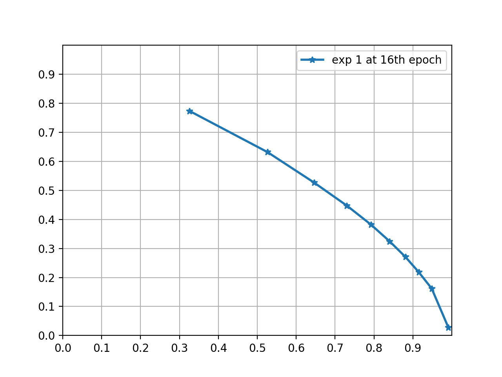
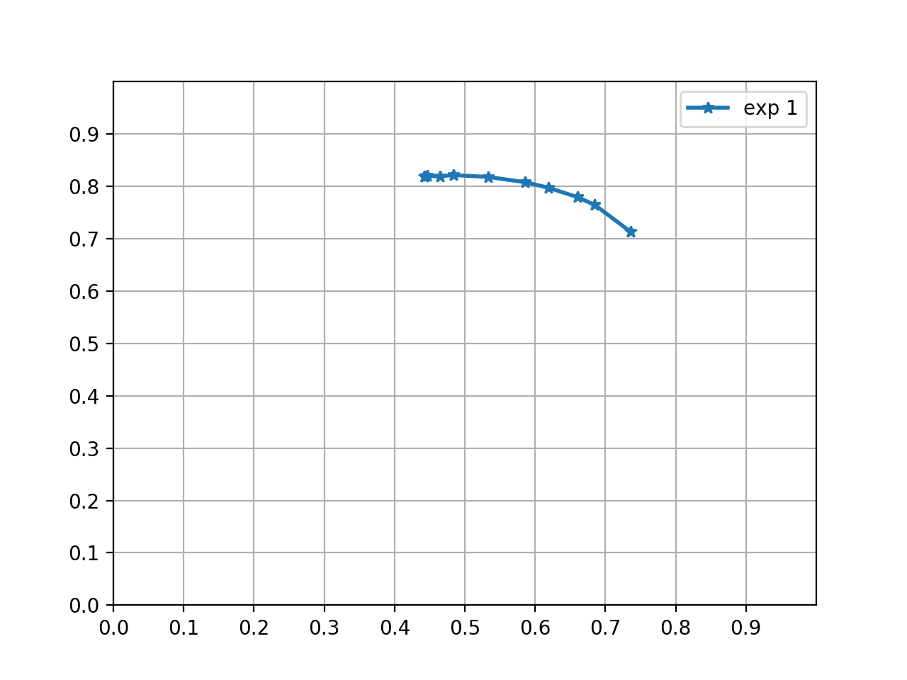

## Code of paper "Learning to Parse Wireframes in Images of Man-Made Environments", CVPR 2018

| Folder/file       | Description                  |
|------------|------------------------------|
| junc      | For training junction detector. |
| linepx    | For training straight line pixel detector. |
| wireframe.py | Generate line segments/wireframe from predicted junctions and line pixels. |
| evaluation | Evaluation of junctions and wireframes. |

## Requirements
- python3
- pytorch==0.3.1
- opencv==3.3.1 
- scipy, numpy, progress, protobuf
- joblib (for parallel processing data.)
- tqdm
- [optional] dominate

The code is written and tested in `python3`, please install all requirements in python3.

## Prepare data
- Download the training data.
    - Download imgs from [OneDrive](https://1drv.ms/u/s!AqQBtmo8Qg_9g37TnqyD9GD3UQwW), put it in __data/__, `unzip v1.1.zip`.
    - Download annotation from [OneDrive](https://1drv.ms/u/s!AqQBtmo8Qg_9g3_etkaVndKnqTdm), put it in __data/__, `unzip pointlines.zip`.
    - Download mat-files for wireframe evaluation from [OneDrive](https://1drv.ms/u/s!AqQBtmo8Qg_9txsENm9ibTKfxAlI), put it in __evaluation/wireframe/__, `unzip linemat.zip`.
    
- Data Structure  
    Each .pkl file contains the annotated wireframe of an image, and it consists of the following variables:  
        |-- imagename: 	the name of the image  
        |-- img:         the image data  
        |-- points:      the set of points in the wireframe, each point is represented by its (x,y)-coordinates in the image  
        |-- lines:       the set of lines in the wireframe, each line is represented by the indices of its two end-points  
        |-- pointlines:     the set of associated lines of each point        
        |-- pointlines_index:       line indexes of lines in 'pointlines'  
        |-- junction:       the junction locations, derived from the 'points' and 'lines'  
        |-- theta:      the angle values of branches of each junction                   

- visualizing the wireframe.  
  After loading the .pkl file, you can run something like the following in Python to visualize the wireframe:
    <pre><code class="python">
     for idx, (i, j) in enumerate(lines, start=0):
        x1, y1 = points[i]
        x2, y2 = points[j]
        cv2.line(im, (int(x1), int(y1)), (int(x2), int(y2)), (0, 255, 0), 2, cv2.LINE_8)
    </code></pre>

- Preprocess data.
    ```
    cd junc
    python3 main.py --create_dataset --exp 1 --json

    cd linepx
    python3 main.py --genLine
    ```
Note: `--json` means you put the hype-parameters in __junc/hypes/1.json__.

## Training
- train junction detector.
    ```
    cd junc
    python3 main.py --exp 1 --json --gpu 0 --balance
    ```

- train line pixel detecor.
    ```
    cd linepx
    python3 main.py --netType stackedHGB --GPUs 0 --LR 0.001 --batchSize 4
    ```

## Testing
- Test junction detector.
    ```
    cd junc
    python3 main.py --exp 1 --json --test --checkepoch 16 --gpu 0 --balance
    ```
- Test line pixel detector.
    ```
    cd linepx
    python3 main.py --netType stackedHGB --GPUs 0 --LR 0.001 --testOnly t
    ```
- Combine junction and line pixel prediction.
    ```
    python wireframe.py
    ```

### Evaluation
The code for evaluation is put in [evaluation/junc](evaluation/junc) and [evaluation/wireframe](evaluation/wireframe).
Expected precision/recall curve is like

<figure class="half">
     
    <center>Junction</center>
    
    <center>Wireframe</center>
</figure>


### Visualize the result
For visualizing the result, we recommend generating an html file using [dominate](https://github.com/Knio/dominate) to
visualize the result of different methods in columns.


## Citation
```
@InProceedings{wireframe_cvpr18,
author = {Kun Huang and Yifan Wang and Zihan Zhou and Tianjiao Ding and Shenghua Gao and Yi Ma},
title = {Learning to Parse Wireframes in Images of Man-Made Environments},
booktitle = {CVPR},
month = {June},
year = {2018}
}
```

## License
You can use this code for your research and other usages, following BSD 2-Clause license.
please credit our work when it helps you.
